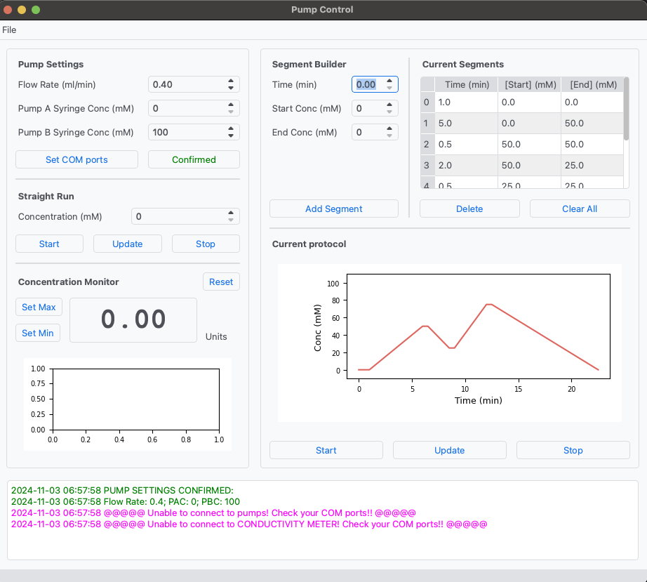

# Pump Controller
Pump controller program for flowing salt buffers to C. elegans. Build upon a modified version of Florian Lapp's nesp-lib library. 

### ABOUT

This is a GUI-based program for controlling two New Era NE-1000X or NE-1002X syringe pumps. I wrote it with the expectation that the two pumps contain buffers with different salt concentrations; these two channels are then combined in line with a static mixer to a chosen concentration. It lets a user easily input protocols consisting of different concentration holds and linear gradients. In theory you can deliver anything this way, not just salt concentrations, but it's hardcoded for that purpose. 

The pumps must have the X1 firmware upgrade (for the linear gradients) but at the moment I don't have any safeguards in place in case you don't have the upgrade, so it will probably just error out if you don't. Have not tested -- on the to-do list. 

### USAGE

New Era pumps operate by telling the pumps to run through a cycle of consecutive phases until a "Stop" phase is reached. Experimental protocols are saved in each pump as phases, and Phase 1 is reserved for flowing the pumps continuously. Thus, phases 2 onwards contain individual steps of a protocol. Each pump can contain a maximum of 41 phases. If you upgrade to the X2 firmware you can increase that to 340 phases or so. This might be worthwhile for more complex experiments. 

**Note**: phases that consist of one pump being paused (i.e. 0% A or 100% A, etc) utilize a "pause" cycle for the appropriate phase number. This function has a limit of 99 seconds. Thus, a pause can quickly cause the number of phases to be longer than expected! For example, a run of 30 minutes at 100% A would result in pump B having a pause ~18 phases long. 

### INSTALLATION 

I haven't really made this user friendly yet -- still need to update setup.py and what not. Anyway, for now -- to install:

1. create a new python environment with pip, and run:

> pip install -r requirements.txt 

2. Install the Python Build package and build in the base directory, then install the built wheel (note that the file name may be different).

> pip install build pyinstaller  
> python -m build  
> pip install dist/PumpController-1.2.0-py3-none-any.whl  

3. You can now run the program by running:

> python PumpController.py

4. As an optional "make it more user friendly" step, use PyInstaller to make it a bit more portable: 

> pyinstaller PumpController.py

This will create an .EXE in dist/PumpController. You can create a shortcut to this on the desktop or somewhere else. 

#########################

To do: 
- Clean up the code to make it more friendly
- Try to get the meter into a separate thread
- Prevent adding more "Phases" to protocol than there is memory. Tally them up? 

